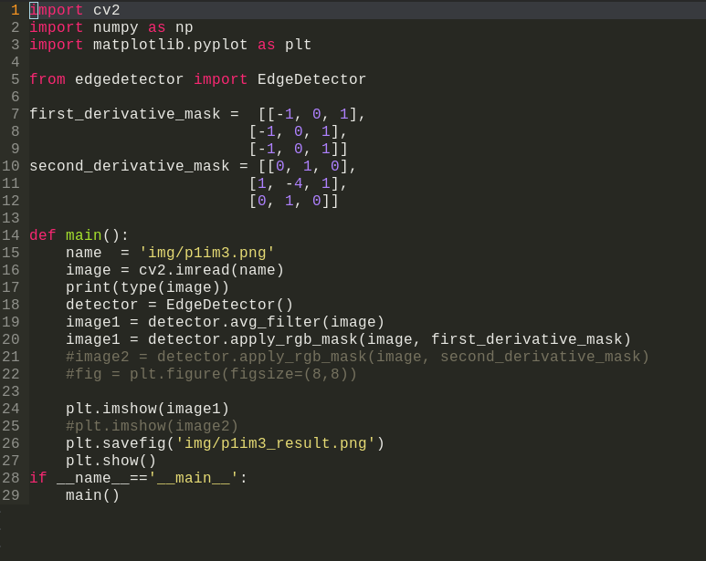
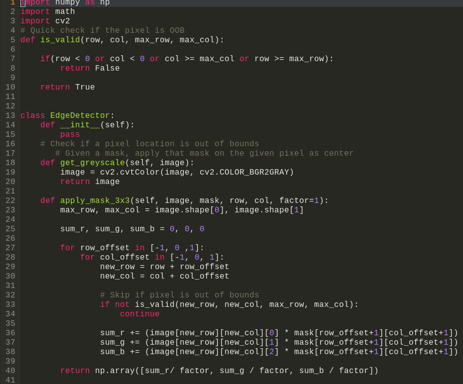
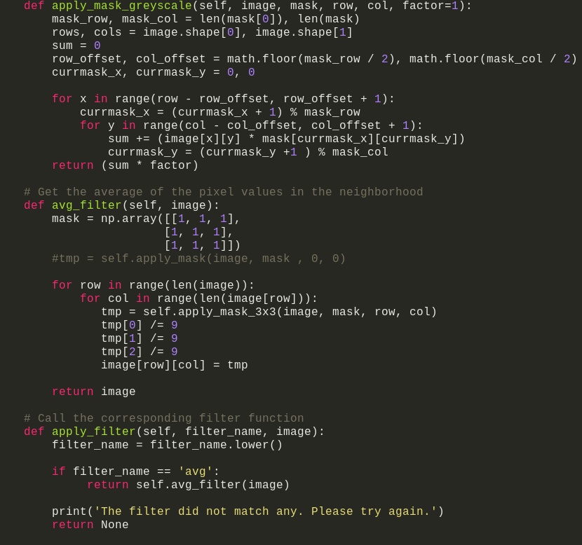
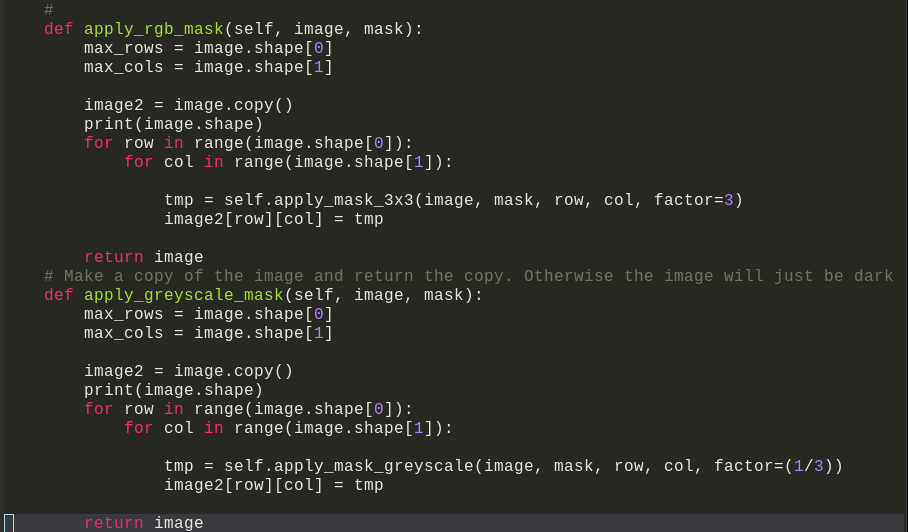

## Introduction

Image segmentation involves assigning each pixel $(x, y)$ a location in a
region of the image. There are many techniques useful for solving this issue. 
For example, we could measure the rate of change between two pixels and apply a 
threshold to determine if there is an edge line that might go through that pixel.

Some important functions that we could use to find different lines and areas in an 
image are the first derivative, second derivative, and the gradient. As mentioned,
all of these techniques measure how much one region changes. We need to apply 
a mask to all of the pixels in a given area and then take the sum of each pixel 
multipleied by a certain weight. For example, the mask could be expressed as 

$\sum_{d = 1}^{D}w_{i,j}m_{i,j}$ 

for all the pixels $d$ in an area $D$.

## Assignment

For this assignment, we took the first and second derivative of different images
to check for their different sections. The different segments of the image will
show up clearly marked in a different color. This presented some questions, 
for example, in the textbook and online resources, most of the examples used 
a greyascale image, but how would it carry over to an RGB image? We could use 
a library such as OpenCV to easily convert the image to greyscale, or we could 
just apply the same mask operation on the three channels. I tried both approaches.
In the end, I think that the images were clearly marked into segments.

{width=60%}

In the normal image, the sky is a bit of a different color. When we take the first
derivative, we can find how the image values change across the image. This is similar 
to taking the gradient at the image, where for the gradient we use

$f(x, y) = (\partial{x}, \partial{y})$ 

To find some of the more fine detail in an image, we can use the second derivative.
The second derivative of an image will bring out finer details in the image.
Following is an example of an image using the second derivative.

 
In this image we can see some of the leaves marked with a different color than the 
rest of the body. This is our clue that this area, along with the animal's belly, 
can be separated from the majority of the rest of the image.

## Screenshots
{width=60%}

{width=60%}

{width=60%}

{width=60%}
