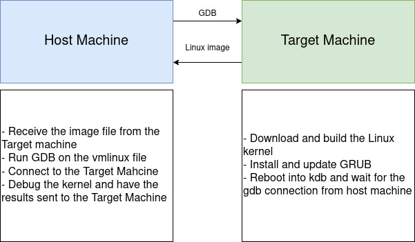

1. **What is a kernel? What are the differences between *mainline*, *stable*, and *longterm*?
 What is a kernel panic**

The **kernel** of the operating system refers to the program that is always running on the 
computer. The kernel might include software for CPU scheduling, file system management, etc...
which are integral to the normal operation of the system. There are different ways to release
an operating system kernel.

The **mainline** kernel is the kernel that is currently being worked on and developed. 
Since there is constant development work occurring on the mainline kernel, there are 
constant releases of this kernel.

Once the mainline kernel has been released and iterated on, it moves to be a **stable**
kernel. The stable kernel receives less updates than the mainline kernel, those usually 
being more significant bug fixes. 

The final step is becoming a **longterm** kernel. This kernel will be mostly be used for 
bugfixes for older versions of the operating system.

A big purpose of these releases and constant updates is to minimize the occurrence of 
**kernel panics**. These are errors which might have serious consequences on the operation 
of the kernel. The causes for a kernel panic might involve unrecoverable errors in
memory, drivers, or other kernel component.

2. **What are the differences between *building*, *debugging*, and *profiling*?**

**Building** the kernel refers to compiling the source operating system source code. 
In the second step of the homework, we download the kernel using the `wget` command. 
Then we further download additional required dependencies and compile the kernel source 
code using the `sudo make -j$(nproc)` command. This turns all the code in the 
corresponding Linux version to a bootable format.

Once we have built the kernel, we have to **debug** it. Like in any program, the operating
system is bound to have some flaws or unintended behavior, or *bugs*. However, since we are
compiling a pretty basic layer of software on which all our other programs run, it is quite 
different. To debug a kernel, we require one machine to make our changes and then we send 
our changes to another machine. 

While we first debug our program and then build it, we still have to measure its performance, 
which we call **profiling**. This process involves tracing the performance or measuring 
the number of system calls to identify potential performance bottlenecks. Programs such as
Valgrind can trace the amount of system memory used, and other such programs can help us
measure how well our programs perform.

3 **What are GCC, GDB, and KGDB, and what are they used for?**

GCC refers to the **G**NU **C**ompiler **C**ollection, a collection of frontends
for various languages. However, if in bash we just type `gcc` we will get the 
C compiler to run. We use this specific compiler to compile the kernel, since much 
of the source code is written in C.

GDB refers to the GNU project's debugger. Essntiallly, we can run the program using certain 
precautions. For example, GDB can start our program and place breakpoints within it. We can 
also check the values of variabales at that point, along with performing small changes 
to debug. For this project, we perform some debugging on the kernel using GDB and then send
the changes to the other virtual machine. In this way, we go around the issue of debugging
the operating system we need to debug the operating system. 

KGDB is a debugging tool used to debug the kernel. For example, in the assignment, we set the 
`CONFIG_FRAME_POINTER` setting inserts code directly in the executable. This code then can 
save the state of the registers during execution. We can then use this code with GDB during
the debugging process.

4. **What are the /usr/, /boot/, /home/, /boot/grub folders for?** 

These folders are all directories under the Linux filesystem. They all have different 
purposes. For example the `/usr/` directory contains user utilities that are shared among 
all users of a system. The `ls` program which lists the files in a directory is located 
in `/usr/bin`, for example.

The `/boot/` and `/boot/grub` folders conern the programs and procedures needed at boot time.
The regular  `/boot/` folder contains code for UEFI (depending on the system) or BIOS, the 
code for `initramfs` which decompresses the kernel during the boot process, as well as the 
actual Linux image file. During the boot process, we use the bootloader to load the initial
filesystem in main memory, which is in charge of loading the main kernel.

Inside the `/boot/` directory there also resides the code for `GRUB`, which stands for the
**GR**and **U**nified **B**ootloader. The bootloader is a program responsible for loading 
the main operating system kernel. GRUB can detect the operating system(s) present on a machine
and provides a way to select which operating system to load. It also allows a restricted command 
line, whose commands are also defined under `/boot/grub`.

The `/home` directory is where most of the individual user's files are kept. When we spawn 
a new terminal, it will place us in the user's home folder, whose contents are only 
available to the currently signed in user.

5. **What are the general steps to debug a Linux kernel?**

Firstly, we need two instances of Linux to debug the kernel. We have to use one instance to 
run actually debug the kernel and then we send the changes to the other Linux instance. We use GDB
to remotely debug the kernel. 

The Target machine is where all our kernel source code is stored. We build the kernel and copy the
image file from the Target machine to the Host machine using `scp`. Then upon restarting 
the Target machine we are brought to the kdb prompt before we log in to the system. At this point,
from the Host machine, we can run `gdb ./vmlinux` to start debuging the kernel image. Then, we set
the target of the debug to be the Target machine using the target machine's IP address. We test this
by using the `continue` command on the gdb prompt and waiting for our Target machine to boot into 
the Ubuntu menu.

The overall  debug process follows these general steps:

{width=80%}

{width=50%}

6. **For this project, why do we need two virtual machines?**

As explained in in question 1, the **kernel** is the program that is always running on the system. All the 
programs we run on our machine interface in some way with the kernel to utilize system resources. This 
includes the debugger. We can't run the debugger on the kernel that is currently executing. 

To remedy this, we have another instance of the kernel running and we have the one machine remotely debug the 
kernel running on the other machine. 

7. **In section 3.3, what are the differences between `make`, `make modules_install`, and `make install`?**
8. **In section 3.4, what are the commands `kgdbwait` and kgdboc=ttyS1,115200 for?**
9. **What is grub? What is grub.cfg?**
10. **List at least 10 commands you can use with GDB.**
