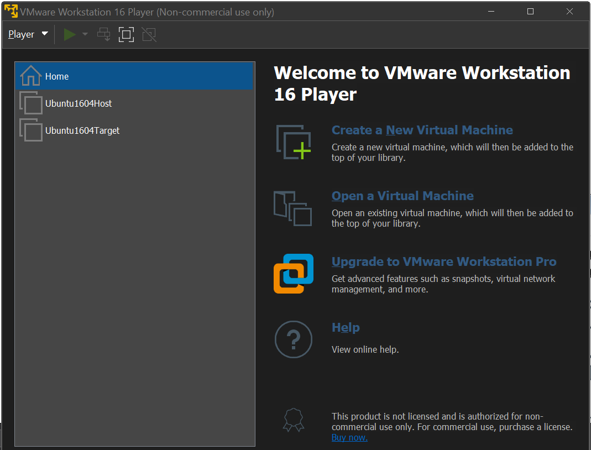

# Discussion Questions

1. **What is a kernel? What are the differences between *mainline*, *stable*, and *longterm*?
 What is a kernel panic**

The **kernel** of the operating system refers to the program that is always running on the 
computer. The kernel might include software for CPU scheduling, file system management, etc...
which are integral to the normal operation of the system. There are different ways to release
an operating system kernel.

The **mainline** kernel is the kernel that is currently being worked on and developed. 
Since there is constant development work occurring on the mainline kernel, there are 
constant releases of this kernel.

Once the mainline kernel has been released and iterated on, it moves to be a **stable**
kernel. The stable kernel receives less updates than the mainline kernel, those usually 
being more significant bug fixes. 

The final step is becoming a **longterm** kernel. This kernel will be mostly be used for 
bugfixes for older versions of the operating system.

A big purpose of these releases and constant updates is to minimize the occurrence of 
**kernel panics**. These are errors which might have serious consequences on the operation 
of the kernel. The causes for a kernel panic might involve unrecoverable errors in
memory, drivers, or other kernel component.

2. **What are the differences between *building*, *debugging*, and *profiling*?**

**Building** the kernel refers to compiling the source operating system source code. 
In the second step of the homework, we download the kernel using the `wget` command. 
Then we further download additional required dependencies and compile the kernel source 
code using the `sudo make -j$(nproc)` command. This turns all the code in the 
corresponding Linux version to a bootable format.

Once we have built the kernel, we have to **debug** it. Like in any program, the operating
system is bound to have some flaws or unintended behavior, or *bugs*. However, since we are
compiling a pretty basic layer of software on which all our other programs run, it is quite 
different. To debug a kernel, we require one machine to make our changes and then we send 
our changes to another machine. 

While we first debug our program and then build it, we still have to measure its performance, 
which we call **profiling**. This process involves tracing the performance or measuring 
the number of system calls to identify potential performance bottlenecks. Programs such as
Valgrind can trace the amount of system memory used, and other such programs can help us
measure how well our programs perform.

3 **What are GCC, GDB, and KGDB, and what are they used for?**

GCC refers to the **G**NU **C**ompiler **C**ollection, a collection of frontends
for various languages. However, if in bash we just type `gcc` we will get the 
C compiler to run. We use this specific compiler to compile the kernel, since much 
of the source code is written in C.

GDB refers to the GNU project's debugger. Essntiallly, we can run the program using certain 
precautions. For example, GDB can start our program and place breakpoints within it. We can 
also check the values of variabales at that point, along with performing small changes 
to debug. For this project, we perform some debugging on the kernel using GDB and then send
the changes to the other virtual machine. In this way, we go around the issue of debugging
the operating system we need to debug the operating system. 

KGDB is a debugging tool used to debug the kernel. For example, in the assignment, we set the 
`CONFIG_FRAME_POINTER` setting inserts code directly in the executable. This code then can 
save the state of the registers during execution. We can then use this code with GDB during
the debugging process.

4. **What are the /usr/, /boot/, /home/, /boot/grub folders for?** 

These folders are all directories under the Linux filesystem. They all have different 
purposes. For example the `/usr/` directory contains user utilities that are shared among 
all users of a system. The `ls` program which lists the files in a directory is located 
in `/usr/bin`, for example.

The `/boot/` and `/boot/grub` folders conern the programs and procedures needed at boot time.
The regular  `/boot/` folder contains code for UEFI (depending on the system) or BIOS, the 
code for `initramfs` which decompresses the kernel during the boot process, as well as the 
actual Linux image file. During the boot process, we use the bootloader to load the initial
filesystem in main memory, which is in charge of loading the main kernel.

Inside the `/boot/` directory there also resides the code for `GRUB`, which stands for the
**GR**and **U**nified **B**ootloader. The bootloader is a program responsible for loading 
the main operating system kernel. GRUB can detect the operating system(s) present on a machine
and provides a way to select which operating system to load. It also allows a restricted command 
line, whose commands are also defined under `/boot/grub`.

The `/home` directory is where most of the individual user's files are kept. When we spawn 
a new terminal, it will place us in the user's home folder, whose contents are only 
available to the currently signed in user.

5. **What are the general steps to debug a Linux kernel?**

Firstly, we need two instances of Linux to debug the kernel. We have to use one instance to 
run actually debug the kernel and then we send the changes to the other Linux instance. We use GDB
to remotely debug the kernel. 

The Target machine is where all our kernel source code is stored. We build the kernel and copy the
image file from the Target machine to the Host machine using `scp`. Then upon restarting 
the Target machine we are brought to the kdb prompt before we log in to the system. At this point,
from the Host machine, we can run `gdb ./vmlinux` to start debuging the kernel image. Then, we set
the target of the debug to be the Target machine using the target machine's IP address. We test this
by using the `continue` command on the gdb prompt and waiting for our Target machine to boot into 
the Ubuntu menu.

The overall  debug process follows these general steps:

{width=80%}

{width=50%}

6. **For this project, why do we need two virtual machines?**

As explained in in question 1, the **kernel** is the program that is always running on the system. All the 
programs we run on our machine interface in some way with the kernel to utilize system resources. This 
includes the debugger. We can't run the debugger on the kernel that is currently executing. 

To remedy this, we have another instance of the kernel running and we have the one machine remotely debug the 
kernel running on the other machine. This means that we can debug some previously impossible commands from
the host machine by specifying the actions on our GDB command line and having the action go to the remote
target which is the target machine.


7. **In section 3.3, what are the differences between `make`, `make modules_install`, and `make install`?**

In general, the `make` program determines which files in a program need to be recompiled and will carry out the 
compilation. In section 3.3, we have to use `make` to compile different parts of our operating system. When
we just use the `make` command, we are going to compile the main kernel, which is the longest step of the 
entire asignment, due to the kernel's size. The result is the image file `vmlinuz`.

After we compile the kernel, we have to compile the system **modules**, or system programs that are not part
of the main kernel but can be loaded by the kernel. We compile these modules with the `make modules` command.
Once we have the compiled modules, we run the `make modules_install` command to install the kernel modules
into the `vmlinuz` image file.

The `make install` command will then will take the binaries created in the previous steps and place them 
in some appropriate binaries, along with other rules.

8. **In section 3.4, what are the commands `kgdbwait` and `kgdboc=ttyS1,115200` for?**

The `kgdbwait` kernel parameter will force the kernel to wait for a connection for the 
remote debugger when starting. Then the next time we start the kernel we will get a gdb command prompt
rather than directly booting into our system.

Now that we are set to wait for a remote connection from a debugger, we next tell kgdb where this serial
connection will be. We specify the `ttyS1` file which we had previously confirmed to be the point of 
connection between our two systems. The next part, 112500 is the name of the port used to communicate 
to the Target machine.

9. **What is grub? What is grub.cfg?**

GRUB is a bootloading program. When the computer first boots, we load an initial bootloader such as BIOS or,
more recently, UEFI. This initial bootloader is located in a fixed location, so we call it **firmware**.
The job of this bootloader is to call another bootloader which is stored on a certain block in the disk.
This second bootloader is GRUB. In the grub settings we have an entry for all the operating systems
present on the system and their location. When executed, GRUB will allow us to choose which operating
system to load.

As is custom with many Linux programs, files ending with `.cfg` are *configuration* files, meaning they
store the settings the program will use. GRUB is no different, and in this file we have entries for all
the operating systems we can boot. There is also the image file to use when loading the OS.

10. **List at least 10 commands you can use with GDB.**

By running the command 

```bash
man gdb
```
we can see some of the commands. They include:
\footnote{These are the lines listed as command in the manual.}

| Command | Description |
|---------|-------------|
|break|Set a breakpoint in function.|
|run  |Start the program.|
|bt (backtrace)|Show the program stack (currently executing).|
|c    |Continue running.|
|next |Execute next program line skipping function calls.|
|edit |Look at the program line.|
|list |Type the text of program closeby.|
|step |Execute next program line including function calls.|
|help |Display help messages.|
|quit |Exit the program.|

# Screenshots and Explanation

{width=70%}

For the first screenshot of the assignment, we can observe the target and the host virtual machines
in VMWare. Using the Ubuntu image file downloaded from the official website, we create two 
identical virtual machines: each gets one CPU core, 100GB of storage (allocated as needed), and 
2GB of RAM initially. I installed the server version of Ubuntu to save on space, so although 
there is no GUI, the commands still worked as intended.

.png){width=60%}

At this point, we had set the pipe name in our VMWare settings. Although it might seem weird to read a connection
through a file, it is consistent with the UNIX design, where famously "everything is a file". The message at the
bottom of the command output refers to the text received from our test machine. Due to the connection being a
serial port, we have to use the `ttyS1` with the `S` rather than just the `tty1`, etc... In the end, whenever 
we receive a message on this serial connection, we can `cat` the file.

.PNG){width=60%}

Now begins the part where we build and configure the kernel. We use the `wget` command to download the content
directly from the `kernel.org` site for the kernel version we need. This downloads a compressed file in the
`tar.xz` format, so we need to decompress it. We then download some of the required packages for compilation
using the `sudo apt install ...` command, along with the names of the programs we wish to install. We also 
used the `cp` command to copy the config file from the `boot/` folder according to our kernel version.
By this point, we should have all the source files we need to compile the kernel, which are shown in the 
screenshot.

.PNG){width=60%}

.PNG){width=60%}

These two screenshots show the settings that we edited. They all are setting the kernel debugger compilation.
The `CONFIG_FRAME_POINTER` setting will leave code blocks behind that can be picked up by our debugger. The 
other settings mostly make sure we are compiling with KGDB set to true so that when we boot the system we 
can go directly to the debugger command line.

.PNG){width=60%}

.PNG){width=60%}

.PNG){width=60%}

These screenshots show the different steps in the compilation and installation process. In the first one, we compile the 
main Linux kernel. This creates the image file, which we will use to boot. We still have to include the kernel modules
into the `vimlinuz` image file. Finally, we install the compiled kernel on our system.

.PNG){width=60%}

.PNG)

As previously mentioned, GRUB is a program that loads an operating system available on the system. When we update the 
configuration file, we are adding entries for all our operating systems. Then when we see the GRUB boot menu on powering
the virtual machine on again we will be allowed to choose from those operating systems.  The second screenshot shows the 
host machine copying the image file with the debug options from the target machine. This is done so that we can run GDB
on the image file from the host machine.

.PNG){width=60%}

.PNG){width=60%}

For the final set of screenshots, we restarted the target virtual machine. Since we compiled the kernel with debug options,
when we boot, we go straight to the debug command line. Since we also compiled with the kgdb set to wait from the `ttyS1`
serial port, we get the message that it's waiting for a remote gdb connection. This is also why we can connect the host 
gdb instance, which we run on the linux image that we copied in the previous section. The second screenshot 
shows the host machine command line having the target machine kernel execution continue. On the target machine,
this means the computer was caused to load. Now we are debugging the kernel on one machine and have it execute on 
another machine.
