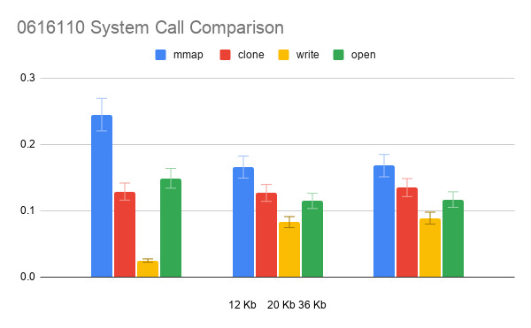

title: "Operating Systems Homework 1 Report"
author: [Andres Ponce, 0616110]
date: "2020-10-24"
titlepage: true,
titlepage-text-color: "FFFFFF"
titlepage-rule-color: "360049"
titlepage-rule-height: 0
titlepage-background: "background.pdf"
---

# Discussion Questions
1. **What is a kernel function? What is a system call?**

A kernel function allows us to interact directly with the kernel. The kernel allows us to write 
functions that implement some of the kernel utilities on the system. For example, if we want 
our program to make a new directory, we can use the provided kernel functions on our operating
system of choice. These functions will then execute the required system calls.

A system call requests something directly from the kernel. However,  a kernel function might 
just be a wrapper around the system call that directly executes the responsible code.

2. **what is KASLR? What is it for?**

KASLR stands for **K**ernel **A**ddress **S**pace **L**ayout **R**andomizer. This utility will
load the kernel in a random place in memory during boot time. If the kernel code were loaded 
in the same memory location every time, then we could exploit the location of the kernel 
functions for some nefarious use. We would just need to know the code structure and then find
a way to insert malicious code into that address space. By loading the kernel at a random 
location in memory, an attack of this sort is made much harder.

We can turn this setting off during boot time by using the `nokaslr` option.

3. **What are GDB's non-stop and all-stop modes?**

In GDB, the all-stop and non-stop modes refer to how the program stops execution. In the former, 
*all* the currently executing threads stop. This allows us to view the entire state of the 
program at a certain point. The latter mode refers to only stopping certain threads while
allowing other currently executing threads to continue.

One might be more useful for isolating the behavior of a single thread, while the other might 
be more useful for viewing the entire state of the program at a given point.

4. **Explain what the command `echo g > /proc/sysrq-trigger` does.**

The `/proc/sysrq-trigger` file allows us to issue instructions directly to the kernel. In the 
Linux file system, the `proc` directory contains information about the currently executing 
processes. The file `sysrq-trigger` *triggers* something to happen in the kernel. The 
`g` that we echo into the file is specifically used by kgdb. This is why kgdb regains control
after we echo it into this file. Besides this, we can also crash the system or immediately
restart the system.

## Questions From Do It Yourself 2
5. **Perf also has the report command. Explain:**
	- **What is it for?**
	- **For fileCopyTest, show and interpret the results.**

The `perf` program measures the performance of commands on Linux. We can get some other 
statistics on how our program is performing, and a complete trace of the system calls 
that are executing.
**Your Screenshot Here**

6. **Perf has more commands. Select another command (besides report, trace and record), 
and explain what it is for and show how to use it.**

If we look at the documentation for `perf`, we see that there are many commands available.


For example, we have the `perf stat` command, which will gather performance counter
statistics on our progam. To use it we can run some shell command or execute some 
program, and it can relay information such as memory usage, cache misses, and other
potentially useful information. To run it we just type

```bash
sudo perf stat [OPTIONS] command
```
where *command* is a shell command.

# Screenshot Discussion 

.PNG){width=60%}

The first step in our homework assignment is to update the GRUB. We disable KASLR, 
which loads the kernel at random locations in memory to avoid potential attacks on
the kernel's memory space. Since this is enabled by default, we have to adjust it 
on the kernel's command line parameters. After we do so, we have to run the
`sudo update-grub` command, which generates `grub.cfg`. However, we have to add again
our own kernel parameters which we added in 1.A. These parameters are the `kgdbwait`
and the `kgdboc=ttyS1,112500`.

.PNG){width=60%}

.PNG){width=60%}

.PNG){width=60%}

.PNG){width=60%}

The next screenshots show in general how we find the definition of the system calls. 
First, we look at the reference of the system calls in teh kernel source code. Then, 
we can look for online references and see which file the system call is in. We can see
that the `mkdir` is in the `fs/namei.c` file. We used multiple references in order 
to make sure that the kernel version does not inlfuence the location of the file 
we need.

.PNG)

At this point, we need to start doing the performance measure on the functions, which 
means we need to connect our host machine's gdb to our target machine. Similar to the 
previous assignment, we need the gdb to remotely execute the debugging on the target machine.
To do this, we use the `(gdb) target remote /dev/ttyS1`, which will send our commands to the
`/dev/ttyS1` and thus to our target machine.

.PNG){width=70%}

.PNG){width=60%}

.PNG){width=60%}

The next pair of screenshots show the process of debugging the kernel `mkdir` function. After
looking up the system call definition in `fs/namei.c`, we created a breakpoint at the 
corresponding system function `do_mkdirat`. Then, we test it by creating the `0616110_directory`.
The gdb output is shown in the second screenshot. In the very last screenshot, the target machine
has the newly created directory which we saw in the previous screenshot. In the meantime, 
since there was a breakpoint at the function, the target machine did not continue executing 
after the directory had been created and triggered the breakpoint. We had to constantly 
tell gdb to continue execution on the target machine.

## Do It Yourself 1

For the first DIY section of the assignment, I chose the common `rmdir` function. The reason 
I chose this function is becuase the debugging process was quite similar. From the
implementation, it was also quite similar to the `mkir` command. It was also being 
implemented in the `fs/namei.c` file, and the naming convection of the system call 
was also quite similar.

.PNG){width=60%}

In the first image, the gdb program already created the breakpoint at the `rmdir` execution,
which is called by the `do_rmdir(...)` function call in the `fs/namei.c` file. We see
the trigger caused by that function in the image, where I just typed `continue` to 
reclaim control of the target machine.

The way we trigger this breakpoint is similar to the one in the given example. In our 
Target machine, we remove a directory using the `rmdir` command in the 
terminal and this systemcall is then invoked. The 
`do_rmdir()` function gets called in the kernel which triggers our gdb instance 
to emit some information. 

.PNG){width=60%}

For the breakpoint, we use the `break do_rmdir` command in GDB so that the Target machine
stops executing. In the file where the systemcall is defined in the kernel (`fs/namei.c`)
in this case, we see the actual C function being called, the `do_rmdir(...)` function.
We then tell GDB to make the breakpoint when this function executes.

.PNG){width=60%}

After we create the break point in GDB, we actually go ahead and execute the 
trigger. The result in the above screenshot is the Host machine, which 
tells us in which file the command executes, and in the topmost section of the 
screenshot, we can see the value of the parameters with which this function was 
called.

.PNG){width=60%}

In the final screenshot, we can just see the action is executed in our Target machine. 
The directory we wanted removed was deleted with the command and we were able 
to analyze the output in the GDB console on the Host machine.

.PNG){width=60%}

The above screenshot shows the gdb triggering the breakpoint when we execute the 
`rmdir` system call, or the `do_rmdir` call in C.o

.PNG){width=60%}

.PNG){width=60%}

For the final section of the assignment, we have to measure the performance of an
empty program and the program that copies the files, and compare which sections of 
code will execute regardless of program content. When we copy the file, after running
the specified commands, we see the copied files with the same contents. The files 
and the copied files are seen in the second screenshot.

.PNG){width=60%}

.PNG){width=60%}

The `perf` program will measure all the system calls and the time it took to execute them. 
We can see the different system calls related to memory, writing, reading, opening files etc..
The results are shown in miliseconds, and we can profile the amount of time it takes to 
execute.

 Once we execute the perf program on the empty C file and the C program that copies the 
programs, we see the difference between the two files using the `diff` program in Linux. 
This program will point the common and different lines in two files. When we use it on the 
two `perf` outputs, we can see the lines that they have in common, i.e. the calls that 
are common to the two files, and the lines that differ among them.

{scale=50%}

The final analysis of the execution time for the system calls used reveal
the relative invariance of the time taken by the system calls regardless of 
file size. The file sizes were 12 Kb, 20 Kb, and 36 Kb, respectively. The 
text used was just the contents of `OriginalFile.txt` copied multiple
times. The only syscall that showed a spike in time required was the 
`mmap` for a file size of 12 Kb.
