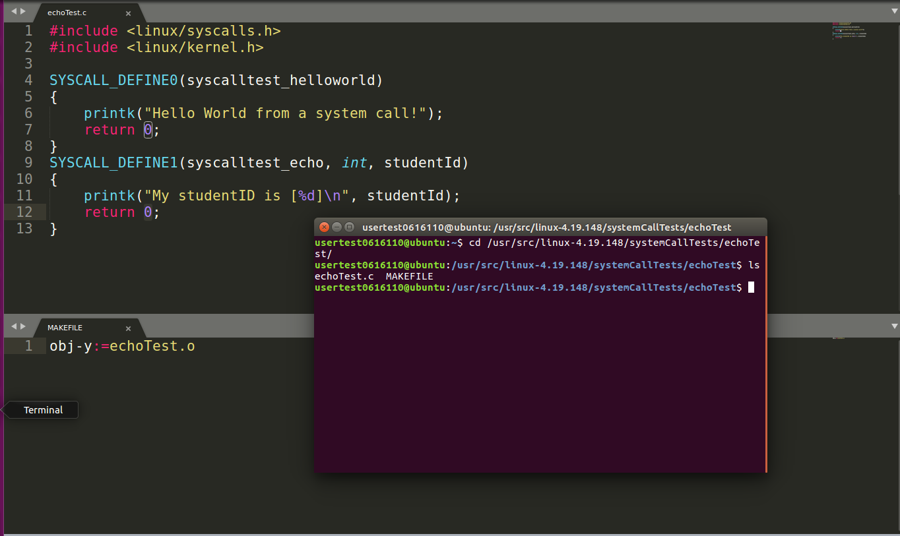
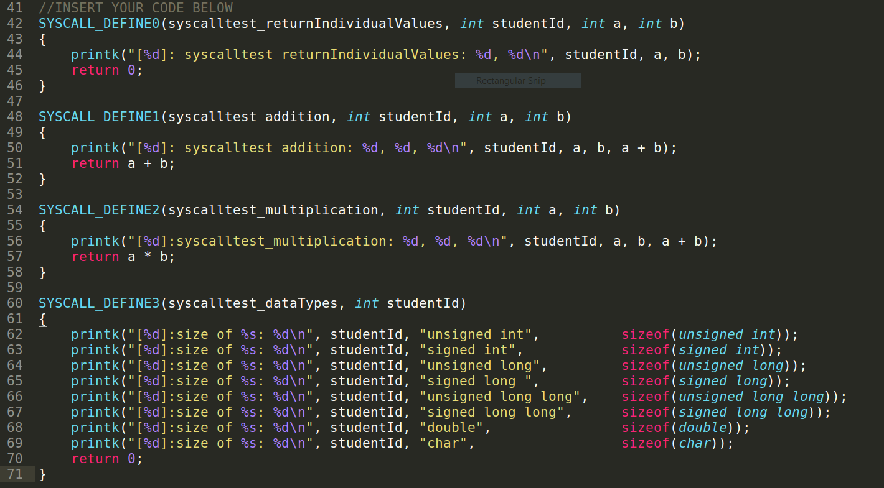

## Video Link
[TBH]()

# Questions
1. **What is kernel space? What is user space? What are the differences between them?**

Our operating system will usually try to separate memory accessible to the user and
memory accessible to the operating system. Kernel modules, device drivers and otherwise
other essential operating system code is run in kernel space. Code that is not 
related to the kernel, i.e. user software, is separated in memory from the kernel 
memory for security reasons. Kernel and user operations are separated to protect the 
kernel from malicious user code. Some exploits rely on accessing memory locations
near user applications, so if we separate user and kernel code, these exploits 
become much harder to perform.

2. **What are protection rings? How many are there? What is Ring 0? What is Ring 1?**

Protection rings are ways of granting different levels of privileges or resource access
to different programs. Each ring allows a program to access different resources. For
example, a user program with little trust (having a higher ring number) would need the 
user's permission to access functionality restricted to rings with lower number. If this
user program wanted to access the camera, for example, it would require user 
authorization. Each protection ring has a number, and the lower the number, the more 
trusted and the more access a piece of software is to the computer's resources. Ring 0
indicates that the user has access to privileged execution of instructions; it can execute
any type of operation. When a program runs in Ring 1, it can be terminated by the operating 
system and is still kept from executing kernel-only operations.

3. **What is a system call? How many types are there in total? What are the differences between
all the types?**

System calls are ways in which we can interact with the computer as users. We can use the 
C language wrappers around the system calls to ask our operating system to perform some 
certain procedure, such as opening/closing files, interacting with drivers, etc...

There are five tpyes of system calls:

- Process Control: Create, terminate processes, etc...
- File Management: Creating, reading and writing into a file, etc...
- Device Management: Reading from  and writing into device buffers.
- Information Maintenance: Handle information passing between user and operating system. 
- Communication: Handle interprocess communication.

All these types of system calls handle different types of operating system functionality, 
from file manipulation to drivers. All the types focus on facilitating communication between
the different aspect of an operating system a user might be interested in changing.

4. **For the custom kernel built in project 1A, where is the list of system calls?**

The file containing a *table* of system calls and their respective IDs is located in 
`/usr/src/linux-4.19.148/arch/entry/syscalls/syscall_64.tbl`.In this file, we can see 
the IDs on the left-hand side and the function name.

5. **What is the system call ID?**

The system call ID is the numeric code by which we can call the system call. When we use the 
`linux/syscall.h` header file, and we call the `syscall()` method, we need to supply it the 
system call ID. This argument will then execute the corresponding system call.

6. **What do the reserved words `asmlinkage` and `printk` mean? What does the command 
`update-initramfs` do?**

When adding our own system calls, we also had to add the function signature in the 
`syscalls.h` header file. The `asmlinkage` phrase indicates that that the function should look
in the CPU stack for its arguments, rather than the register. Paired with a `#define` in our 
program, we can have all the functions look to the stack for their arguments. Also, it allows
our function to be called from assembly language files.

The `printk()` function in C allows us to print a message to the kernel log buffer. We can use this
command for tracing and debugging, similar to how people use the regular `printf()` for this
purpose.

For the `update-initramfs` command, we have to recall what happens during boot time. During the 
boot process, our kernel has to load our system's main file system. To do this, it first has to 
load an initial file system into memory, or an **init**ial **ram** **f**ile **s**ystem. The 
kernel loads the compressed file system and decompresses it in memory, and uses it to load 
our complete file system.

7. **How do you use `printk()`? How do you read messages printed by printk()?**

In order to use the `printk()` function, we have to include the corresponding header file, 
`linux/kernel.h`. This header file contains many basic functions related to kernel software 
development. However, this function as mentioned does not print messages to stdout as does 
`printf()`, rather it prints messages to the kernel buffer. We can view the written message
by executing the `dmesg` command from our terminal.

8. **What is the kernel ring buffer? How do you read its contents?**

The kernel ring buffer keeps the debug messages related to kernel functionality. Once we load the 
system, the kernel will write the debug messages to a certain file. The buffer will store a certain
amount of messages before starting to delete them. We can use the `cat` command to view the 
contents of `proc/kmsg` file, or `/var/log/dmesg` in some systems.

9. **What is a function signature?**

The function signature tells the compiler the basic information about the function and how it is
to be called. It contains the function name, return type, and a list of arguments.
An example might be 
```c
int foo(int*, char);
```

In this line, we tell the compiler that function `foo` will take in an integer pointer and a
character and return an integer. Whenever we then call the function, the compiler will know 
whether the call is a valid one or not, and issue an error if required.

10. **What does `SYSCALL_DEFINE[n] mean? What is n?`**

`SYSCALL_DEFINE[n]` is a macro used by the kernel to declare system calls. These macros are 
usually ended with a number indicating the argument count. When this code is evaluated, this 
macro will be expanded by the compiler to code that correctly performs the system call invocation.

11. **For a system call wrapper (SYSCALL_DEFINE), how does its function signature look like 
when it has 0 inputs as parameters? 1 integer number as input? 2 integer numbers as inputs? 3
integer numbers as inputs?**

For  a system call wrapper with only one input, we only require the `SYSCALL_DEFINE()` and 
inside the parentheses we place the function name. Since the syscall requires one argument,
we then place the types of our arguments inside.

12. **Does the function signature of a `SYSCALL_DEFINE` wrapper change depending on the element
returned?**
The wrapper signature does not change, since the actual system call definition is implemented 
in another file.

13. **What is `#include<linux/kernel.h>`? What is `#include <linux/syscalls.h>`?**

`linux/kernel.h` includes some of the basic kenrel functions that allow the user program to interact
directly with the kernel. In this assignment, we used `printk()`, which is defined in that file.
`linux/syscalls.h` refers to the kernel interface which allows us to directly call systemcalls.
When we call a systemcall, we specify the numeric id of each one and also supply any required
parameters.

## Screenshot Discussion

{width=60%}

For the first part of our project, we have to define our own systemcall.
The `syscalltest_helloworld` and `syscalltest_echo` system calls are defined
in the `echoTest.c` file. This file contains the `SYSCALL_DEFINE` directive, 
which when compiled will expand the function into a proper C-style 
function. At compile-time, these directives get expanded into proper syntax.
The `printk()` function will print messages to the kernel ring buffer, rather than
to stdout as does `printf()`

{width=60%}

{width=60%}

The `syscall_64.tbl` file contains the list of all the different system call functions 
that are 64 bit. Thus to add our own system calls, we also have to add them to the 
list of already existing system call functions. The two images above show the file's
contents before and after adding the system calls. Since the system calls are quite 
long, they have to wrap to the next line. We add the system calls at the very end 
of the system calls with the `common` description. In my case, that corresponded 
to call number 548 and 549.

{width=60%}

The final step before compiling the kernel is to define the functions in the system 
header file. This allows us to call the system calls from user programs by including
the `linux/syscalls.h` file. In the C language, this gives us the ability to call all 
the functions in that file. Thus in the `echoTest.c` file we can use the 
`systemcall(num)` function to call the system call with the corresponding id.


After compiling the kernel, the kernel has already been compiled with our system 
calls included. This means that we can now call our own system calls just like how 
we would any other from the kernel. We can use `printk()` to log some messages to the
kernel ring buffer for debugging purposes if we are a developer (or to check our progress
in an assignment if we are a student). The kernel ring buffer contains the debug output
of many different system calls, however it is dumped after it is full.

{width=60%}

To define our own sytem calls, we need to use a specific syntax. The version of 
`SYSCALL_DEFINE[n]` we will use depends on the number of arguments to our system call.
Also, we have to separate the arguments by a parenthesis from the name. Thus, for example
if our call takes an `int studentId` as parameter, we would write this as `int, studentId`.
In the above image, we have four user defined functions:

- **syscalltest_returnIndividualValues**: Takes as an input our studentId and two 
numbers *a* and *b*. This function merely prints them out to the kernel ring buffer 
and returns a 0.

- **syscalltest_addition**: This system call again takes three arguments,`studentId`, 
`a` and `b`. We print out our studentId to the kernel ring buffer, and then we 
print the sum of the other two integer arguments we provided. Thus in the kernel 
ring buffer we should see a message that contains four values.

- **syscalltest_multiplication**: This function is similar to the addition system call.
We provide our studentId, and two integer parameters. The system call will then print
out the values of the numbers and will also print out their product.

- **syscalltest_dataTypes**: This system call will only take our studentId as an argument.
Then, it will print out the sizes of many different types of data in C. So, in the
kernel ring buffer we should expect to see several lines with the size in bytes of
these different data types in C.
