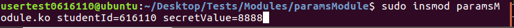

## Video Link
[Click here](https://youtu.be/r1w03z_QpR4)

If it doesn't work here is the link: https://youtu.be/r1w03z\_QpR4

# Questions
1. **What is a static kernel module? What is a dynamic kernel module? What is the other
name of a dynamic kernel module? What are the differences between system calls and 
dynamic kernel modules(mention at least 3)?**

A kernel module extends the functionality of the kernel without being part of it. 
These modules are loaded by the main kernel, so they are not part of the main kernel.
We can load and unload these modules by demand by using the `insmod` and `rmmod` commands.
Dynamic kernel modules, also known as **loadable kernel modules** can be loaded by the
user to add custom functionality to the kernel. Static kernel functions, on the other 
hand, are loaded at boot time after the intiial ram file system loads the kernel, and 
are required by the system to boot.

There are some differnces between kernel modules and system calls, which we implemented
in our previous project. Firstly, system calls require us to recompile the entire 
kernel, since they can access some kernel resources. Kernel modules are also located
outside the kernels, so modifying, inserting, or removing kernel modules does not 
require a recompile.

2. **Why does adding a system call require kernel re-compilation, while adding a kernel
module does not?**

System calls are part of the kernel. This means that we cannot dynamically 
load new system kernels during execution of our operating system.  System calls would
be like adding a new function to a C source code file. In order for the function 
to be available we have to save the source file and recompile the program. 

Kernel modules, on the other hand, are different because they are loaded in from the outside.
They don't require the kernel to be recompiled because their source code is not directly
inside the kernel. Continuing our C source code example, this would be like having a C
program that reads variables from an external file and then adding a variable to that 
external file. Since we are not changing the source code of the program and instead 
adding modifications from outside, our program does not require a recompile.
3. **What are the commands `insmod`, `rmmod`, and `modinfo` for? How do you use them?**

These commands all deal with kernel modules. `insmod` `ins`erts a `mod`ule into the Linux 
kernel. The `rmmod` command removes a module from the Linux kernel, and the `modinfo` command
shows the info associated with a particular kernel module.

To use these kenrel modules, we need to know the name of the module, as well as what
program options we would like to provide.

4. **Write the usage of the following commands:**
* `module_init`

The `module_init()` system call will load the module into the kernel space. Once it 
allocates space and can initiaize the module parameters, it will call the module's
`initialize()` function, which we pass as an argument. In our module, we print the 
values of our kernel parameters out to the kernel ring buffer.

* `module_exit`

In contrast to the  `module_init()` system call, the `module_exit()` function takes
care of wrapping up our module when the module is removed or otherwise terminated.
The parameter is a function pointer to the cleanup routine we want to execute. In
our case we again reprint the values to the kernel ring buffer, some of which might
be changed.

* `MODULE_LICENSE`

The `MODULE_LICENSE()` specifies the license under which our module exists. The "GPL"
string represents the "GNU Public License", specifically v2 of that license. This 
license enables the software to be distributed freely according to the 
philosophy of the Free Software Foundation. In our project, we use it by placing it
at the top of the file.

* `module_param`

The `module_param()` command adds a parameter to our module, and we specify three 
parameters: the value to be modified, the type, and a mask for the permission. The 
last value is explained more in detail later. 

* `MODULE_PARM_DESC`

This command specifies how to use the module parameter, what it does and how to use it.
It is printed out when we inspect the module using `modinfo`, since that will print
the descriptions for all the values.

5. **What do the following terminal commands mean? (Explain what they do and what does
the `-x` mean in each case):**
* `cat`

The `cat` command prints out the contents of a file to standard output. It can also
concatenate files.

* `ls -l`

The `ls` command is one of the most fundamental commands in Linux, and it lists the
contents in a directory. When we give it the `-l` option, it will use a "long listing"
format, where it indicates the permissions on the directory contents, the user which 
created them, the group the user belogns to, the size, and the time each was created.

* `dmesg -wH`

The `dmesg` command prints the contents of the kernel ring buffer. This means that any
message we write in the `printk()` function  will appear in this buffer. The `-wh` 
options signify two things: that the buffer should wait for new messages (`-w`), and
that the contents should be printed out in human readable format (`-H`).

* `lsmod`

The `lsmod` command will list all the currently loaded kernel modules and their status.
It formats and prints out the contents of `/proc/modules`.

* `lsmod | grep`

The first command in this sequence is the same as the previous command, however, we 
"pipe", or send the results of `lsmod` to `grep`. `grep` looks for patterns in 
standard input, so we can use it to search whether our own kernel modules are running.

6. **There is a -644 in the line**

```c
module_param(studentId, int, 0644);
```
**inside `paramsModule.c`. What does 0644 mean?**

The 0644 in the function call represents a mask for the parameter's visibility in
`sysfs`. `sysfs` is a pseudo file-system which provides an interface to the kernel
data structures. 0644 specifically means that our parameter will be "root-writeable".
We could also specify 0444 if we wanted our parameter to be writable by any user.

More generally, a mask is a a value that is used in bitwise operations. So when the 
value 0644 is used in a bitwise operation with some other value, it will result in 
the permissions we can use.

7. **What happens if the initialization function of the module returns -1? What type of
error do you get?**

This error means that the module was not able to be initialized. Normally, the function
will return 0 in case that the module terminates normally. Maybe there was an error in 
the format of the function or the module was already loaded and thus the initialization
function cannot run.

8. **In section 1.3 - step 6, `modinfo` shows the information of some variables inside the 
module but two of them are not displayed. Why is it?**

In the `paramsModule.c` file, the `initialize()` function runs as soon as we load the 
module. Inside this function, we print out the values of the module, and we only 
print out some of the kernel module values. The reason we don't see all the variables
in the debug buffer is because those values are not print out when our module
initializes.

9. **What is the `/sys/module` folder for?**

The `/sys/module` folder stores the information regarding all the currently loaded 
kernel modules. Inside the folder of each kernel module, we can find the current
values used by the module. We can read and change the values, if we have the correct
permissions. For the `paramsModule02` and `calculatorModule`, we are mostly interested
in the parameter values which the module stores in the 
`/sys/module/$(module name)/$(parameter name)`.

10. **In section 1.3 (`paramsModule.c`), the variable `charparameter` is of type `charp`. What is `charp`?**

`charp` in the module parameter declaration refers to a `char *`, or a pointer to a 
`char`. The macros used by the Linux kernel to check the validity of the parameters
will eventually expand the value to a `char` pointer, which in C functions as a string.

# Screenshot discussion

{scale=40%}

The first module we created in the project involves just printing
a value to the kernel ring buffer when we load and remove the kernel
module. The `initialize` function will execute whenever the kernel 
module is loaded and the `clean_exit` function will be executed 
when the module is removed.

The `Makefile` on the top right corner specifies the rules for how 
to build and compile the files. The first line specifies that the  
target file is in module form. The `all` and `clean` are different
rules for where and how to compile certain files.

{scale=50%}

As specified previously, the `make` command specifies how the project or certain 
files are to be compiled. When the command is run in the command line, this is the 
output. In the output we see that the make program uses the 
`/usr/src/linux-4.19.148` directory to make the kernel module
file, `helloModule.ko`. Afterwards this resulting file will be the 
one that we load into the kernel.

{scale=30%}

In the `helloModule.c` file, we have a procedure specified when we initialize the 
module and when we remove the module. These functions get bound in the `module_init()`
and `module_exit()` function calls, to which we pass the function. The output in the
screenshot is the output after the `initialize` function has been called.

{scale=60%}

While our module is loaded from the previous step, we use the `lsmod` to list all the
currently loaded kernel modules. We pipe this ouptut to the `grep` command which will
look for the name of our module. We do this to check if the module has been loaded.

{scale=50%}

When we unload `helloModule`, we will see the state of the module parameters. In 
the future excercises we will change the values of the parameters in between the 
time of loading and unloading. Here, the code inside the `clean_exit()` function 
is executed. 

{scale=60%}

In a previous screenshot, we searched for the loaded kernel module among the output
of `lsmod`. Here we repeat the same command after using the `rmmod` command to remove
the module. The `lsmod | grep` command returns nothing since `helloModule` has already 
been unloaded.

{scale=40%}

The next kernel module we designed involved passing parameters to the module.
In `paramsModule02.c` , the lines with the `module_param()` function
will add a parameter of a certain type to the module. If we have 
the modifyValues parameter toggled, then we will change some of the 
other parameters. We can toggle this value from the command line
or dynamically from another file.

{scale=60%}

In terminal 1, we load and remove the module using the `insmod` and `rmmod`
commands. This causes the module to execute the functions we specified in the 
`module_init()` and `module_exit()` functions. Thus the parameters are printed
in the kernel ring buffer. In this step, we have not changed any of the 
parameters, so the values in the exit method will be the same as the ones
in the input. Unless we specify the `modifyValues` parameter, we won't change
their values..

{scale=60%}

{scale=60%}

In the first screenshot, we first print the module information, such as the 
parameter names, their types, and a short description. Next, we load the module
again, except this time when we load the module we use the command

```shell
sudo insmod paramsModule.ko modifyValues=1
```

which will cause the values of some of the parameters. Our code will check this 
value and change some of the parameters in accordance with the code.

The next screenshot shows the values after they are changed. The `modifyValues`
parameter will replace the studentId and message with some dummy values,
which then get printed to the kernel ring buffer.




{scale=60%}

In the previous section, we had changed some parameters of our module from 
within the module file. The first screenshot shows how we can change the 
parameters of the file directly from the command line. The module is then 
loaded with those parameters and we can thus see it on the kernel ring buffer.

The kernel keeps track of the module paramter's values inside of a file. 
Originally, the secret value was 8888 but we can change it by going into the 
file and just replacing the old value with 7777. When we remove the module, 
we should see the updated value being printed on the kernel ring buffer.

The last screenshot is again the values of the parameters once we remove the
module and its exit function is executed. This shows that once we edit 
the values in the files, the module will use the new values.

{scale=80%}

When we try to change a variable that cannot be changed, we will get a 
message in the kernel ring buffer that displays a message saying 
we cannot change that value. The reason that this parameter is not 
recognized is that we did not add it to the list of parameters. So, even though
`dummyStudentId` is a variable inside our file, it is seen as a local variable
rather than a valid module parameter.


The first creates the image for reading the module. We then pass it to the 
`init_module()` macro, which will attempt to load the module with
the parameters passed in the `paramsNew` string. We also have to allocate 
some memory space for the memory image.

The next image shows the two methods we run on loading and removing the modules.
The last two lines, `module_init(initialize)` and `module_exit(clean_exit)` 
are bound to the module, so these functions will execute on module loading 
and removing, respectively.

{scale=60%}

{scale=60%}

{scale=60%}

{scale=60%}

Once we are done with writing the module code, we have to compile the program that loads
and unloads the module. `loaderUnloader.c` contains the calls necessary to load the 
module and give it the parameters we need.

We then load the module with our student Id as parameter, which is displayed in the 
kernel ring buffer once we call `dmesg -wH`. There are also the secret value and 
the string inside the module which we print to the kernel.

So far we have compiled our module, loaded it to the kernel, and we saw the result of the
`initialize()` function being printed to the ring buffer. To indeed check whether 
paramsModule, or any other module, is loaded, we can run the `lsmod` command in 
combination with `grep` to check whether the module is loaded.

Lastly, we unload the module when we allow `loaderUnloader` to finish executing. The 
second part of the program will unload the module and again print the values to the
kernel ring buffer.

{scale=60%}

{scale=60%}

{scale=60%}

{scale=60%}

For the last part of the assignment, we had to write our own module which took in
some parameters and called the module to perform some arithmetic operation. The final
output on the terminal is shown in the first image, where we try out all the three
operations along with two numbers. Before the module is loaded, the name of the 
module and the final string are shown on screen.

For the second screenshot, we show the dmesg output once we load the module. Here
we essentially just print out the values that were passed on to the module at load time,
and we see some of the initialization and unloading. 

The third screenshot shows the structure of the `addition`, `subtraction`, and 
 `multiplication` functions. The most important part is having a string which 
contains the name of the operation and the two arguments, each parameter separated by 
a space. Inside the `prepare_args()` function, we use the `snprintf()` C function to 
format the string accordingly. We then copy the string into the `args` buffer and return 
the string ready for use.  The `apply_module()` function will mostly replicate the code
for loading and unloading the module used for `paramsModule()`, with a couple 
important additions:

1. It will pass along our string as a parameter when calling `init_module` (also used in
`paramsModule`).
2. It will return the arithmetic result of the operation after reading it from the 
parameter file.
\footnote{This parameter is found in `/sys/module/calculatorModule/parameters/resultParam`.}

The last screenshot shows the actual code responsible for the arithmetic operations in
`calculatorModule.c`. At the moment we load the modules, the parameters will already 
be set to the values we need them at. Therefore, in the `initialize()` method all we 
need to do is just perform the correct arithmetic operation based on the value of the
`operationParam` string, which we determine with `strcmp`.


